# Chat Merger

The goal of this project is to combine the WhatsApp chats into conversations.

Definitions:
- _Chats_ are the raw exports from the data holders.
- A _conversation_ is a compiled file that contains all the messages from all the chats that belong together.

The chats are collected from dataholders

## Quickstart

1. Scan the input folder for chats
   ```python
   chats = get_chats_from_path(input_dir)
   chats_dict = create_parser_config(chats.values())
   with open(os.path.join(output_dir, 'all_chat_settings.json'), 'w') as f:
       json.dump(chats_dict, f, indent=2)
   print(f'Step One: Found {len(chats)} chats')
   ```
2. Check the config if the datetime format is correct
3. Map the chats to conversations
   ```python
   chats = get_chats_from_config(os.path.join(output_dir, 'all_chat_settings.json'))
   chat_mapping = get_chat_mapping(chats)
   
   create_configs(sorted_mapping=chat_mapping,
                  config_dir='Configs',
                  chats=chats,
                  config_path=output_dir)
   
   file_hashes_dict = get_file_hashes(root_directory=input_dir)
   print(f"Step Three: Found {len(chat_mapping)} conversations")
   ```
4. Check the config if the chat mapping is correct. Do not check the participant mapping yet.
   Add chats that where not find by the chat mapping, and remove chats that where incorrectly matched.

5. Regenerate the configs. This will regenerate the mapping in case new chats are added or incorrect chats are removed.
   ```python
   file_list = os.walk(output_configs_path)
   for root, _, files in file_list:
       for file in files:
           if not file.endswith('json') or file == 'all_chat_settings.json':
               continue
           config = load_config(os.path.join(root, file))
           merger = WhatsAppMerger(config=config, config_dir=output_configs_path)
           regenerate_phonebook_config_for_conversation(merger=merger,
   print("Step Five: Regenerated the configs")
   ```
6. Check the configs for the participant mapping
7. Merge chats into conversations
   ```python
   file_hashes_dict = get_file_hashes(root_directory=input_dir)
   file_hashes_df = pd.DataFrame.from_dict(
       file_hashes_dict,
       orient='index',
       columns=['hash']
   ).reset_index(names='path')
   file_hashes_df = file_hashes_df[~file_hashes_df.path.str.endswith('txt')]
   file_hashes_df['path'] = file_hashes_df.path.apply(Path)
   file_hashes_df['parent'] = file_hashes_df.path.apply(lambda x: x.parent)
   
   hash_files_dict = {v: k for k, v in file_hashes_dict.items()} if file_hashes_dict else {}
   hash_files_df = pd.DataFrame.from_dict(
       hash_files_dict,
       orient='index',
       columns=['path']
   ).reset_index(names='hash')
   
   file_list = []
   for root, subdirs, files in tqdm(os.walk(output_configs_path)):
       for file in files:
           if file != "all_chat_settings.json" and file.endswith('json'):
               file_list.append([root, file])
   
   errors = {}
   with tqdm(total=len(file_list), desc='Processing') as pbar:
       for root, file in file_list:
           pbar.set_description(f'Processing config {file}')
           process_config(root=root,
                          file=file,
                          conversation_folder=os.path.join(output_dir, 'Conversations'),
                          reports_folder=os.path.join(output_dir, 'Reports'),
                          config_dir=output_configs_path,
                          file_hashes_dict=file_hashes_dict,
                          file_hashes_df=file_hashes_df,
                          hash_files_df=hash_files_df)
           try:
               pass
           except Exception as e:
               print(f'Er is iets fout gegaan terwijl {file} verkwerkt werd: {e}')
               exc_type, exc_obj, exc_tb = sys.exc_info()
               fname = os.path.split(exc_tb.tb_frame.f_code.co_filename)[1]
               print(exc_type, fname, exc_tb.tb_lineno)
   print("Step Seven: Created conversations and reports")
   ```

## Configuragion files
### What's in the configuration?
```json
{
    "start_date": "01-12-2019", // First day included in the conversation
    "end_date": "23-03-2024",   // First day NOT included in the conversation
    "conversation_name": "WhatsApp conversatie Test export nieuwe naam\u201d", // Conversation name, used in filenames
    "files": { // Dictionary of files included in the conversation
        "absolute\\path\\to\\Chats\\Alice Wonderland\\Export 1/WhatsApp Chat with Test export.txt": {
            "phone_os": "android",
            "datetime_format": "%m/%d/%y, %H:%M",
            "datetime_certain": true,
            "example_date_1": "5/1/22, 16:08",
            "example_date_2": "5/2/22, 16:28",
            "start_date": "01-05-2022",
            "end_date": "03-05-2022",
            "load": true,
            "data_holder": "Alice Wonderland"
        },
        "absolute\\path\\to\\Chats\\etc/....txt": {...}
    },
    "mapping": {
        "Alice Wonderland": [ // New name in merged conversation
            [
                "Bob Bobsen", //Dataholder
                "Alice"       // Name as seen in chats from dataholder
            ]
        ]       
    },
    "phone_book": {
        "+31612345678": "Alice Wonderland",
        "+31633333333": "Dave Davidson",
        "+31611111111": "Bob Bobsen",
        "+31622222222": "Carol Christmas"
    }
}
```

### Working configuration for example data
You can use this configuration for the example data, only the file paths need to be corrected for your location.
```json
{
    "start_date": "01-12-2019",
    "end_date": "23-03-2024",
    "conversation_name": "WhatsApp conversatie Test export nieuwe naam\u201d",
    "files": {
        "absolute\\path\\to\\Chats\\Alice Wonderland\\Export 1/WhatsApp Chat with Test export.txt": {
            "phone_os": "android",
            "datetime_format": "%m/%d/%y, %H:%M",
            "datetime_certain": true,
            "example_date_1": "5/1/22, 16:08",
            "example_date_2": "5/2/22, 16:28",
            "start_date": "01-05-2022",
            "end_date": "03-05-2022",
            "load": true,
            "data_holder": "Alice Wonderland"
        },
        "absolute\\path\\to\\Chats\\Bob Bobsen\\Export Bob/WhatsApp Chat with Test export.txt": {
            "phone_os": "android",
            "datetime_format": "%m/%d/%y, %H:%M",
            "datetime_certain": true,
            "example_date_1": "5/2/22, 16:08",
            "example_date_2": "5/2/22, 16:37",
            "start_date": "02-05-2022",
            "end_date": "03-05-2022",
            "load": true,
            "data_holder": "Bob Bobsen"
        },
        "absolute\\path\\to\\Chats\\Carol Christmas\\Export Carol/WhatsApp-chat met Test export.txt": {
            "phone_os": "android",
            "datetime_format": "%d-%m-%Y %H:%M",
            "datetime_certain": true,
            "example_date_1": "02-05-2022 16:08",
            "example_date_2": "02-05-2022 16:35",
            "start_date": "02-05-2022",
            "end_date": "03-05-2022",
            "load": true,
            "data_holder": "Carol Christmas"
        },
        "absolute\\path\\to\\Chats\\Dave Davidson\\Dave 1 media/_chat.txt": {
            "phone_os": "iphone",
            "datetime_format": "%d-%m-%Y %H:%M:%S",
            "datetime_certain": true,
            "example_date_1": "02-05-2022 16:08:13",
            "example_date_2": "02-05-2022 16:44:36",
            "start_date": "02-05-2022",
            "end_date": "03-05-2022",
            "load": true,
            "data_holder": "Dave Davidson"
        }
    },
    "mapping": {
        "Alice Wonderland": [
            [
                "Bob Bobsen",
                "Alice"
            ],
            [
                "Dave Davidson",
                "+31 6 12345678"
            ],
            [
                "Alice Wonderland",
                "your"
            ],
            [
                "Alice Wonderland",
                "Alice"
            ],
            [
                "Dave Davidson",
                "+31612345678"
            ],
            [
                "Carol Christmas",
                "Alice"
            ],
            [
                "Alice Wonderland",
                "Alice Wonderland"
            ]
        ],
        "Dave Davidson": [
            [
                "Dave Davidson",
                "Dave"
            ],
            [
                "Bob Bobsen",
                "+31 6 33333333"
            ],
            [
                "Carol Christmas",
                "Dave"
            ],
            [
                "Alice Wonderland",
                "Dave Priv\u00e9"
            ],
            [
                "Dave Davidson",
                "Dave Davidson"
            ]
        ],
        "Bob Bobsen": [
            [
                "Bob Bobsen",
                "Bob Bobsen"
            ],
            [
                "Dave Davidson",
                "+316 11111111"
            ],
            [
                "Bob Bobsen",
                "Bob"
            ],
            [
                "Alice Wonderland",
                "Bob Bobsen Work"
            ],
            [
                "Carol Christmas",
                "+31 6 11111111"
            ]
        ],
        "Carol Christmas": [
            [
                "Carol Christmas",
                "Carol"
            ],
            [
                "Carol Christmas",
                "Carol Christmas"
            ],
            [
                "Bob Bobsen",
                "+31 6 22222222"
            ],
            [
                "Dave Davidson",
                "+31 6 22222222"
            ],
            [
                "Alice Wonderland",
                "Carol Christmas Work"
            ]
        ]
    },
    "phone_book": {
        "+31612345678": "Alice Wonderland",
        "+31633333333": "Dave Davidson",
        "+31611111111": "Bob Bobsen",
        "+31622222222": "Carol Christmas"
    }
}
```

## How does the merge algorithm work?

### Step 1: Scan the input folder for chats
First, go through all the files in the input folder. For each .txt file, determine whether it is for an iPhone or 
Android. After determining the type, create a basic configuration for the respective device.

### Step 3a: Map the chats to conversations
For each chat scanned in step one, gather all messages that contain at least 10 characters. Compare each collection 
of messages with all other chats. If at least 10% of 'current' messages match those in the 'other' chat, then a match is
found. The measure used is the [Overlap Coefficient](https://en.wikipedia.org/wiki/Overlap_coefficient).

### Step 3b: Map the authors within a conversation

To generate a phone book, we first identify authors in various chats. This identification is based on the following:

1. **Announcements**: 
   - We use predefined templates for standard WhatsApp messages. For example:
     - "{admin} created this group"
     - "{admin} added {name}"

2. **Sent Messages**:
   - We collect data on messages sent by individuals.

3. **Merging Matches**:
   - If we identify that two different names refer to the same person, we merge these entries.

If phone numbers are known, we save the phone number with the corresponding contact name.

#### 1. Creating a Phone Book Based on Announcements

1. **Only Messages Without Authors**:
   - We use templates for standard WhatsApp messages to match these messages.

2. **Template Matching**:
   - For each template-message combination, we check for a match.
   - If a match is found, we save the variables (e.g., admin name, added person's name).

3. **Bundling Matches**:
   - For each unique application of a template at a specific time, we bundle the found matches.
   - For example:
     - "Alice created this group" → admin: Alice
     - "Alice (Work) created this group" → admin: Alice (Work)
     - We know that Alice and Alice (Work) are the same person.

#### 2. Creating a phonebook based on messages
1. **For Each Author in Each Chat**:
   - Collect all messages with at least 10 characters.
2. **Compare Message Collections**:
   - Compare each collection of messages with all other collections from different chats.
   If at least 50% of 'my' messages are present in the 'other' chat, identify it as a match.

#### 3. Merging Matches

1. If A and B are identified as a group, and B and C are identified as a group, we create a group A, B, and C.
2. By default, we choose the longest name for the group, excluding any digits.

 
### Step 7. Merge conversations
#### Attachements
1. **Hashing**: All files are assigned a unique key based on their content through a process called hashing. As a result, two different files with the same content will receive the same key.
2. **Bundling**: Files that have the same key are grouped together.
3. **Replacing Media in Chat**: For each message that references a file, one of the grouped files is chosen as the source file and placed in a separate media column.
4. **Done**: Now, attachments from different phones refer to the same file on the disk.

#### Messages

| step                                                                                        | data                                                                                    |
|---------------------------------------------------------------------------------------------|-----------------------------------------------------------------------------------------|
| Step 0: original data                                                                       | 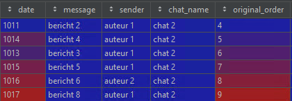 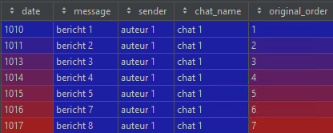 |
| Step 1: Combining messages and media, join messages on datetime, author and message-media   | 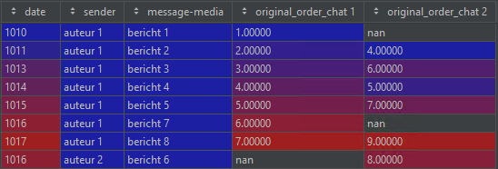                                             |
| Step 2: Sort Messages                                                                       | 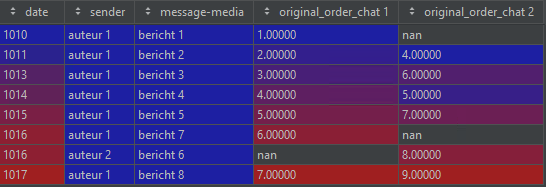                                             |
| Step 3: Reset original order                                                                | 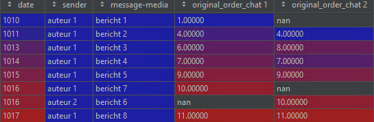                                             |
| Step 4: Determine which messages are not in order based on original order                   | 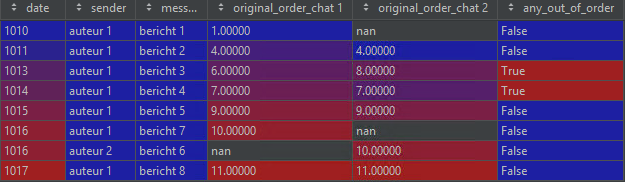                                             |
| Step 5: Determine final order                                                               | 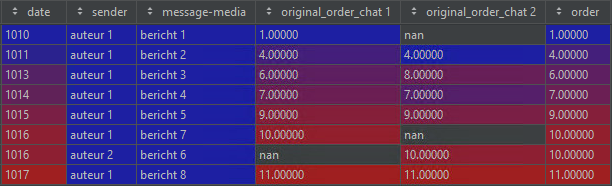                                             |
| Step 6: Determine which messages are not in order based on not having a unique order number | 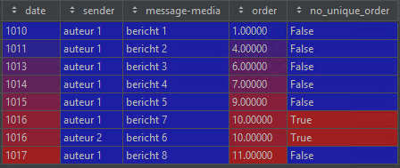                                             |
| Step 7: Determine which messages are not in order                                           | 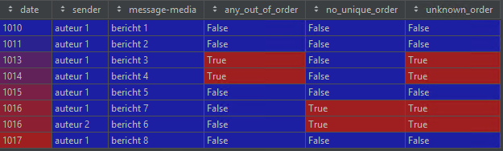                                             |
| Step 8: Determine message source for each message                                           | 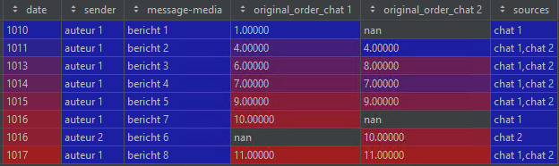                                             |
| Step 9: Final result                                                                        | 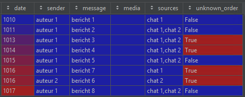                                             |


## Parsing exported chats

When a chat is parsed the following data is extracted:
 - _date_: Datetime of the send message 
 - _message_: The original message
 - _file_: The .txt file that is extracted
 - _original_order_: The orginal order the parser encounterd the messages
 - _sender_: The author of the message
 - _media_: The file name of an attachement, when the message contains an attachement
 - _data_holder_: The data holder of the file

### Recognizing the Type of Phone
When parsing a file the Parser can recognize the datetime format based on dates in the file. The OS is also automatically recognized.

**iPhone:**
- If the first character of the first line matches `[`
  Example:
  ```
  [02-05-2022 16:08:20] Author: Message
  ```

**Android:**
- If the first character of the first line is a number and there is a hyphen `(-)` within the first 18 characters.
  Examples:
  ```
  5/2/22, 16:08 - Author: Message
  ```
  ```
  02-05-2022 16:08 - Author: Message
  ```


## Recognizing Date/Time Notation**

1. Read all possible dates in the chat.
2. Find 1-4 digits before a `/` or `-`. 
    - This is a day, month, or year.
    - If the number consists of 4 digits, it is a year.
    - If the number is greater than 12, it is a day.
    - Otherwise, it is a month.
3. Find 1-2 digits before a `/` or `-`.
    - This is a day or month.
    - If the number is greater than 12, it is a day.
    - Otherwise, it is a month.
4. Find 1-4 digits before a `/` or `-`.
    - This is a day, month, or year.
    - If the first number is not a year, it is a year.

